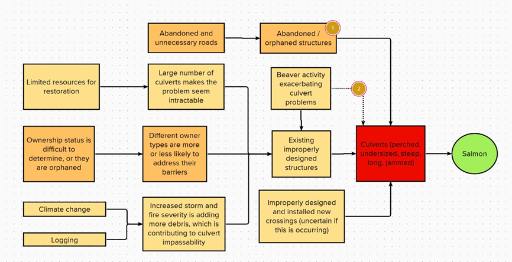
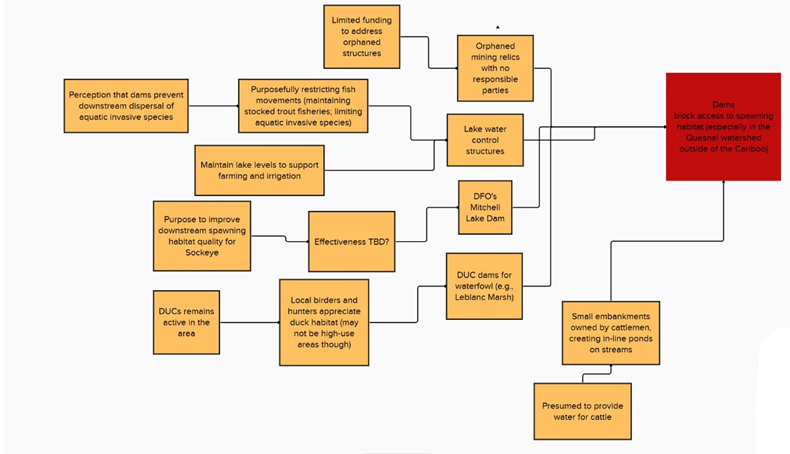

# Appendix E - Situation Analysis {-}

The following situation model was developed by the WCRP planning team to “map” the project context and potential causes and effects. This can be used as reference and related back to Strategies and Actions going forward.  

