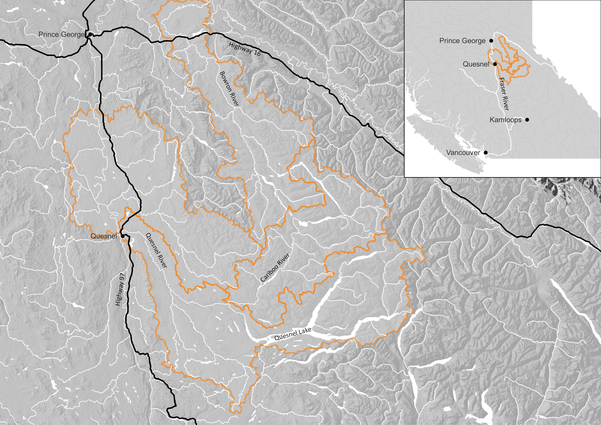

# Introduction {-}

## Purpose{-}

The purpose of the Lhtako Dene Nation Watershed Connectivity Restoration Plan (WCRP) is to improve understanding of habitat connectivity for Coho Salmon (*Oncorhynchus kisutch*), Chum Salmon (*O. keta*) and Sockeye Salmon (*O. nerka*) in the portions of the Quesnel, Cariboo, Cottonwood and Bowron watersheds within LDN territory (“LDN watersheds”) and inform efforts to close knowledge gaps and plan and prioritize restoration.  

Local data and knowledge are combined with connectivity modelling to estimate current connectivity status and identify structures that potentially block the most habitat. This informs the prioritization of field assessments to close the most significant knowledge gaps efficiently. Information from field assessments of barrier status and habitat condition are incorporated into the model, improving understanding of which barriers block the most habitat. 

This information is also used to inform and plan restoration efforts. Structure rankings inform restoration prioritization by summarizing what is known about fragmentation and showing the relative amount of habitat upstream of each barrier. Actual prioritization of restoration activities is a social decision that requires additional information, including the quality and condition of upstream habitat, the cultural importance of different areas within the watershed, and the costs and logistics of addressing each barrier relative to the ecological benefits of doing so.  

As knowledge gaps are closed and barriers are addressed, this plan is revised to summarize progress and provide updated estimates of connectivity status and the status and relative importance of remaining structures. 

## Vision Statement  {-}

The Lhtako Dene Nation’s territory and surrounding territories are under increasing environmental threat from human activities and climate change. We aim to provide training and mentorship to members of our community and partnering nations, to enable them to undertake the prevention and mitigation of harmful blockages in our water systems. Our nation’s health, culture, and future depend upon the return of Pacific salmon for future generations. We borrow this land from our youth, and we have a promise to take care of it until they can take of it themselves.  

## Scope  {-}

This WCRP focuses on habitat connectivity for Pacific Salmon in the LDN watersheds (Figure 5). Culturally and economically important populations of Chinook, Coho and Sockeye Salmon are all found in these watersheds, which historically supported Indigenous sustenance and trading economies. The model takes into consideration those portions of the LDN watersheds that are expected to support spawning or rearing habitat for all three species of Pacific salmon together, to allow for a more comprehensive planning approach. However, the connectivity status, structure ranks and counts, and maps are presented for Pacific salmon spawning and rearing, separately, to tailor decision-making towards life-stage and habitat specific needs.   

Connectivity models in this WCRP focus on longitudinal habitat fragmentation by anthropogenic structures, including all types of dams and stream crossings. Additionally, mining activity throughout the watersheds is considered when determining the value of addressing downstream barriers. Natural barriers that could be managed to increase fish passage include sediments at tributary mouths and side channels and beaver dams. Mining activity, sediment accumulation, and beaver dams are not mapped as structures in the connectivity models but are instead flagged as playing an important role in the overall watershed connectivity and habitat quality. Diffuse natural barriers that make entire areas impassible are not included in the models but may be used to define the scope of this WCRP. For example, a tributary that is inhospitable because of increased water temperature may be excluded from the overall spatial scope of the WCRP because restoration needs there are broader than connectivity. 

## Mining Activity {-}

Mining activity in the LDN watersheds includes developed prospects, past producing mineral mines, coal mines with aggregate mines, and placer tenures (Pacific Salmon Foundation 2024). However, the focal area of this WCRP has a history of mining activity that pre-dates the current mining tenure records, and abandoned placer mines are prevalent on the landscape. Many of these mines included stream channel diversions that have the potential to continue to fragment the landscape. A current estimate of disconnected habitat due to mining activity could not be calculated based on the available information in its present form. Barriers resulting from historic or current mining activity could be locally significant. Consideration of how to locate and prioritize sites for field assessment will therefore need to be developed as part of this plan. 

## Sediments at Tributary Mouths and Side Channels {-}

Downstream transport of sediment from deforestation and land clearing has resulted in accumulation of sediments at tributary mouths and side channels. The location and extent of sediment accumulation is not currently mapped, so an estimate of the disconnected habitat due to sediment accumulation could not be calculated. Barriers resulting from sediment accumulation could be locally significant, particularly if they are located at the mouth of streams with extensive habitat upstream. Consideration of how to locate and prioritize sites for field assessment will therefore need to be developed as part of this plan. 

## Beaver Dams {-}

Beaver dams are relatively common in the LDN watersheds but are often temporary in nature. Although there is a potential for beaver dams to impede or block passage for focal species, the locations of beaver dams are currently unmapped and may not be easily mapped due to the ongoing formation and varying persistence on the landscape. Although beaver dams can be easily managed when impeding fish passage, doing so may require annual staff and resources allocated to beaver dam removal. There is an interest in understanding how beaver dams were traditionally managed by the Lhtako Dene peoples. 

